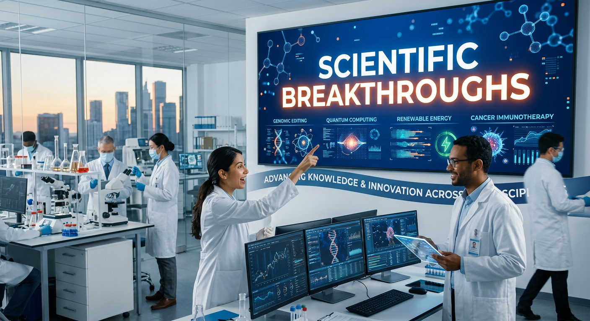
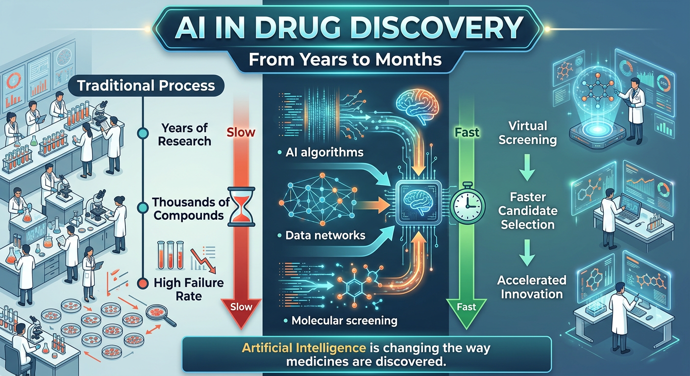
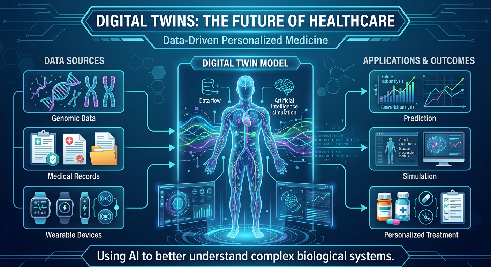

## Project Status

🚧 Completed - Pending Teacher Review

# The AI Revolution in Biology 

An independent research project exploring how Artificial Intelligence, Data Science, and Computational Tools are transforming scientific discovery and helping researchers solve complex problems.

## Research Question

How are Artificial Intelligence and Machine Learning transforming modern Biology, and how are these technologies accelerating scientific discovery and personalized healthcare?

## Research Areas

- Artificial Intelligence
- Data Science
- Bioinformatics
- Personalized Medicine

## Project Highlights

## AlphaFold and Protein Structure Prediction
Exploring how DeepMind's AlphaFold solved one of Biology's biggest challenges and accelerated scientific discovery.

## Generative AI and De Novo Protein Design
Investigating how Artificial Intelligence can design entirely new proteins with potential applications in medicine and biotechnology.

## AI-Driven Drug Discovery
Examining how machine learning models help researchers discover drug candidates faster and more efficiently.

## Digital Twins and Personalized Medicine
Digital twins may allow researchers and clinicians to simulate biological responses and optimize treatments.

• Artificial Intelligence
• Data Analysis
• Computational Thinking
• Scientific Research
• Problem Solving
• Critical Thinking

## Project Visuals

## AlphaFold and Protein Structure Prediction

One of the most fascinating things I discovered during this project was that AI can now predict protein structures with remarkable accuracy. Problems that once required years of laboratory work can now be approached using powerful computational tools and machine learning models such as AlphaFold.

---
Artificial Intelligence is helping researchers identify promising drug candidates much faster than traditional methods. Instead of testing compounds one by one, AI systems can analyze huge datasets and help scientists focus on the most promising solutions.

---

## Digital Twins and Personalized Medicine

Digital Twin technology shows how biology, medicine, data science, and Artificial Intelligence can work together. By creating virtual models of patients, researchers may be able to simulate treatments and better understand how different therapies could perform before they are applied in real life.

## Project Files

- Research Report (PDF)
- Figures and Infographics
- References

### Access Full Report
[The AI Revolution in Biology](AI_Revolution_in_Biology.pdf)

## Author

Sarp AKAR

Sept 2026

