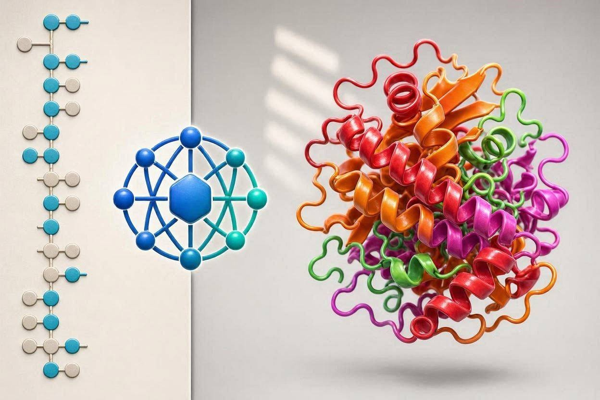

# The AI Revolution in Biology 🤖🧬

An independent research project exploring how Artificial Intelligence is transforming Molecular Biology, Protein Structure Prediction, Drug Discovery, Bioinformatics and Personalized Medicine.

## Research Question

How are Artificial Intelligence and Machine Learning transforming modern Biology and accelerating scientific discovery?

## Research Areas

- Artificial Intelligence
- Machine Learning
- Molecular Biology
- Bioinformatics
- Computational Biology
- Data Science
- Personalized Medicine

## Project Highlights

## AlphaFold and Protein Structure Prediction
Exploring how DeepMind's AlphaFold solved the protein folding problem and accelerated biological research.

## Generative AI and De Novo Protein Design
Investigating how AI can design novel proteins with potential applications in medicine and biotechnology.

## AI-Driven Drug Discovery
Examining how machine learning models help identify drug candidates faster and more efficiently.

## Digital Twins and Personalized Medicine
Understanding how AI may support future healthcare through individualized prediction and treatment strategies.

## Skills Demonstrated

- Scientific Research
- Artificial Intelligence
- Bioinformatics
- Computational Biology
- Data Analysis
- Scientific Writing
- Critical Thinking

## Project Visuals

## AlphaFold and Protein Structure Prediction

Artificial Intelligence can predict protein structures with remarkable accuracy using deep learning models such as AlphaFold.

---
Machine learning enables researchers to identify promising drug candidates faster and at a lower cost.

---

## Digital Twins and Personalized Medicine

Digital twins may allow researchers and clinicians to simulate biological responses and optimize treatments.

## Project Files

- Research Report (PDF)
- Figures and Infographics
- References

## Author

Sarp AKAR
Prospective Molecular Biology Student
